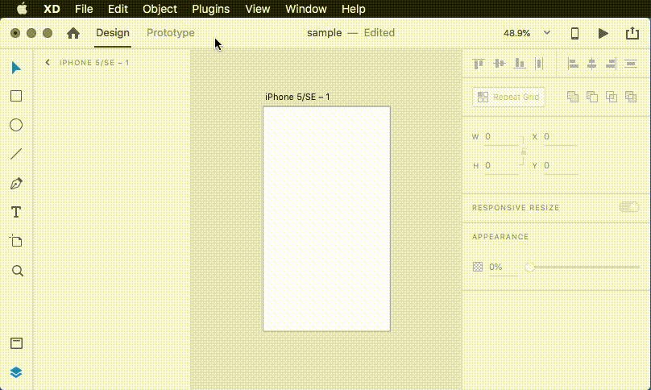
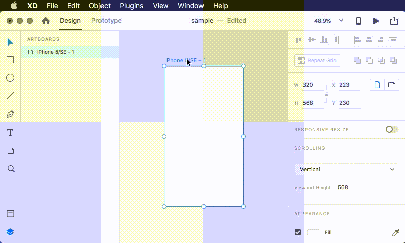

# Adobe XD Plugin Meetup サンプルコード


## 開発環境のセットアップ

1. 適当な場所にリポジトリをチェックアウト

    `git clone https://github.com/AdobeXD/plugin-samples.git plugins`

    もしくは [zipファイルをダウンロード](https://github.com/yoshikinoko/XDPluginMeetupJapan/releases/latest)

2. `develop` フォルダ（開発用プラグインフォルダ）を開く

    Mac:

    `~/Library/Application\ Support/Adobe/Adobe\ XD\ CC/develop`

    Windows:

    `C:\Users\%USERNAME%\AppData\Local\Packages\Adobe.CC.XD_adky2gkssdxte\LocalState\develop`

    もしくは Adobe XD を起動した後に下記のメニューより開く

    `プラグイン` >`開発版` > `開発フォルダーを表示`

3. `develop` フォルダにリポジトリ（または回答したzipファイル）のディレクトリをコピー

    サブフォルダ（または buildフォルダ）内の`main.js`, `manifest.json`, `images/iconl.png`などを **フォルダごとコピー** する

    Mac:

     ```bash
      cp -r 01-01-scenegraph-sample ~/Library/Application\ Support/Adobe/Adobe\ XD\ CC/develop/
     ```

    Windows:

    Windows Explorerでコピー＆ペースト

4. Adobe XDを起動し、新しいドキュメントを作成

5. Adobe XD のメニューより、プラグインを再読み込み

    `プラグイン` > `開発版` > `プラグインを再読み込み`

    ショートカットキー　Mac: `Command+Shift+R` Win: `Ctrl+Shift+R`

6. Adobe XD のメニューより、プラグインを起動

    `プラグイン` >　`プラグイン名`

## サンプルコードの概要

### 1. Dialogを表示しないPlugin

### 1.1 サンプルコードのみ

[01-01-scenegraph-sample](./01-01-scenegraph-sample)

### 1.2 webpack, xdpm を用いたプロジェクトテンプレート

[01-02-scenegraph-sample-webpack](./01-02-scenegraph-sample-webpack)



### 2. Dialogを表示するPlugin

### 2.1 サンプルコードのみ

[02-01-dialog-sample](./02-01-dialog-sample)

### 2.2 webpack, xdpm を用いたプロジェクトテンプレート

[02-01-dialog-sample-webpack](./02-01-dialog-sample-webpack)




## 参考資料・サイト

### 日本語

- [はじめてのAdobe XDプラグイン開発！定番のHello Worldを表示させてみよう \#AdobeXD \#AdobeMAX \- Adobe Blog](https://blogs.adobe.com/japan/web-getting-started-with-xd-plugin-development/)
- [Adobe XD Plugins Advent Calendar 2018 \- Qiita](https://qiita.com/advent-calendar/2018/xdplugin?fbclid=IwAR0aTdPE0eNtR5utjXZriObs7c0NdzyO81aqX2RXbr2GPvTr1o0c_sfLjy4)
- [Adobe XD User Group Japan facebook group](https://www.facebook.com/XDUGJP/)
- [Adobe XD official facebook page ](https://www.facebook.com/adobexdcc/)
- [Adobe XD \- Adobe Blog](https://blogs.adobe.com/japan/tag/adobe-xd/)
- [Creative Cloud 道場 \- Adobe Blog \#CCDojo](https://blogs.adobe.com/japan/creativecloud/ccdojo/)
- [Adobe XD CC体験版ダウンロード](https://www.adobe.com/jp/products/xd.html)
- [アドビ公式サイト](https://www.adobe.com/jp/)

### 英語

- [Adobe XD Platform](https://adobexdplatform.com/)
- [Adobe XD Plugin Developers Forum](https://forums.adobexdplatform.com/)
- [Adobe XD Github](https://github.com/adobexd)
- [Adobe I/O](https://www.adobe.io/)

## LICENSE

Apache 2.0

## DISCLAIMER

You use this utility at your own risk. Under no circumstances shall Adobe be held liable for the use, misuse, or abuse of this utility.

Use of this utility means that you agree to Adobe's [Terms of Use](https://www.adobe.com/legal/terms.html) and the [Adobe Developer Additional Terms](https://wwwimages2.adobe.com/content/dam/acom/en/legal/servicetou/Adobe-Developer-Additional-Terms_en_US_20180605_2200.pdf).
